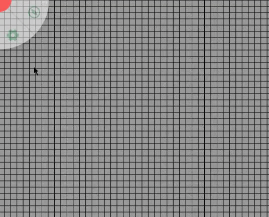
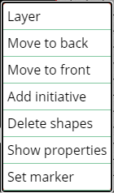
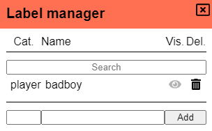

# Assets

The asset menu is used for inserting assets into your game. 
These can be maps, tokens, objects, or anything else you wish to insert. 
To access this menu, click the <font-awesome :icon="['fas', 'cog']"/> icon and click “Assets” from the dropdown menu.

## Asset Manager


If you’re just starting out, you will have no assets. 
To add them, you will need to enter the Asset Manager by clicking .

### Creating Folders


To create a folder, click the create folder icon.
A dialogue box should appear where you can write the new folder name.
With the folder created, you can place your assets into the folder for easier navigation.

### Uploading Files


To upload files, click the upload files icon.
This will open your file system.
Choose the asset you wish to upload to your campaign.
Once uploaded, your files will be accessible in-game. 

## Placing Assets



To use your assets, first open the asset tab. 
Then, open the folder where you have stored your files.
Last, drag the asset onto the game board. 
Your asset will now be able to be manipulated.

## Manipulating Objects

You can move your shapes by selecting the “select” tool.
Then you can click and drag the shape to move.

When the shape is selected, you may also use your arrow keys to move it.
As the DM, holding down shift lets you move shapes through movement-blocking terrain.

To select more than one shape, hold down ```Ctrl``` and click each shape you wish to collect.

By default, most shapes snap to the grid.
To temporarily disable this, hold down ```Alt```. 

To deslect shapes, press the ```d``` key. 



Right clicking on a shape will give you a list of options.
These allow you to do specific things with your shapes.

### Layer

Hovering over the “Layer” option in the list lets you change which layer you want your shape on.
For more information, check the [layers](/docs/dm/layers/) document.

### Move to Front & Move to Back

These options place your shape at either the front or the back of the layers.
This allows you to place multiple objects on the same layer but have them overlap in specific ways.

### Add initiative or Show initiative

This option places tokens in the initiative menu.
If already in the initiative menu, this will appear as “show initiative”.
For more information, check the [initiative](/docs/tools/intiative/) document.

### Delete shapes

This option deletes the selected shape(s).
You may also press ```Del``` to do this.

### Show properties

This option opens the “Edit asset” menu, described below.

### Set marker

This option sets the shape as a marker.
When an shape is added as a marker, it can be accessed from the dropdown menu.
To access the Markers menu, click the <font-awesome :icon="['fas', 'cog']"/> icon and “Markers”.
In the Markers menu, you can click the label of the shape to quickly snap your view to that shape.

## Edit asset


By right clicking and selecting the “Show properties” option, you open the “Edit asset” menu.
This menu includes a plethora of options.

### Is a token

Selecting this option classifies the object as a token. 
Tokens function fundamentally differently than other shapes.

Tokens cannot pass through shapes with the 'blocks movement' option enabled. 
Tokens are also effected by lighting.
Check the [lighting and vision](/docs/dm/light-shadows/) document for more information on how lighting works in relation to tokens.

When a user-controlled token becomes incapacitated, one can disable this option. 
This will ensure the controlling player no longer accesses the shape's vision.

### Is invisible

Selecting this option turns the shape invisible to all players, except those with vision or edit access to the shape.
As the DM, you will still be able to see the shape.
This can be useful for having objects that are invisible but player-controlled, or invisible, but still affecting movement. 

There is currently no special indicator that shows it's invisible to other users. 

### Is locked

Selecting this option locks the shape in place.
This can be useful for maps you don’t want to accidently move while playing.
Press ```Ctrl + L``` to do this without opening the Edit asset menu.

### Show badge

Selecting this option displays a badge at the bottom right of the shape.

### Blocks vision/light

Selecting this option blocks vision and light from passing through the shape.
More information about lighting can be found in the [lighting and vision](/docs/dm/light-shadows/) document.

### Blocks movement

Selecting this option prevents other shapes from moving through it.
This is useful for creating walls in your dungeon you don’t want your players to pass through.

For the DM, you may still pass through shapes that have this option enabled. 
To do this, hold down ```shift``` and move the shape.

### Border colour & Fill colour

These option applies to basic tokens.
Border colour controls the colour of the borders around the basic token
Fill colour of controls the colour of the inside of the basic token.

### Access

Here is listed the players who have access to the shape.
Selecting a player name and “add access” will allow them to interact with the shape.
Selecting any of the icons next to “default” gives all players access to the shape.
The pen icon allows those with access to edit the shape.
The four arrows icon allows those with access to move the shape unless locked.
The lightbulb icon allows those with access to see the shape. 

### Trackers

Trackers can track various values of shapes, such as health to player tokens, or attitude to NPC.
To use, under “name” label the value you wish to track, such as health.
Next, write the current value which the player has and the maximum value.
By clicking the eye icon, you can toggle whether this information is public to all players or strictly visible to the DM.

With these values established, when you click the shape, you will now see the values in a quick menu.
You can quickly edit these values by clicking the number and typing in the new value.

This can be used for health, gold, death saves, or any other value that you need to track. 

### Auras

Auras are visible light which emanates from a shape.
These can be any color or strength you wish.

More information about lighting can be found in the [lighting and vision](/docs/dm/light-shadows/) document.

### Labels



Labels allow the DM to categorize shapes.
To start, type a category at the bottom left.
Then, type a name within that category.
This will appear above.
Under Cat. is the category, and under Name is the specific member of that category.

To assign an shape its category, click on the label in the list.
To the right is an eye icon, which makes this label public.
Beside that is the option to delete the label.

Once these categories have been defined, you can click “filter” in the bottom right corner.
This will present a menu of all categories.
Enabling one shows you all shapes with that category.

### Annotation

At the bottom of the Edit asset menu is a space to write anything localized on that one shape.
These will also appear when you mouse over the shape.
